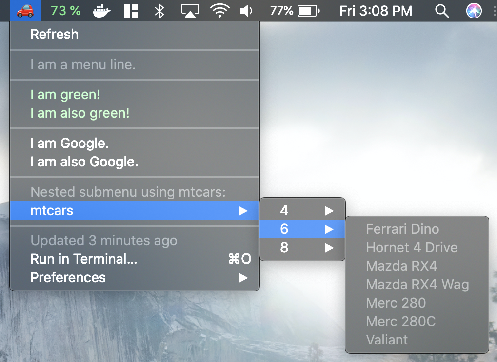

# bitbaR
 Mac Menus with R
 
 Example menu:
 

First, [install Bitbar](https://github.com/matryer/bitbar/releases/download/v1.9.2/BitBar-v1.9.2.zip), an open source tool for creating Mac menus with any language. ([More information](https://getbitbar.com))

Next, install bitbaR.
```R
install.packages("devtools")
devtools::install_github(jsowder/bitbaR)
```
Finally, create your menu.
```R
bitbaR::bb_new("MyMenu", path = "path/to/your/bitbar/folder")
```

From there, the template file will explain itself. Have fun!
